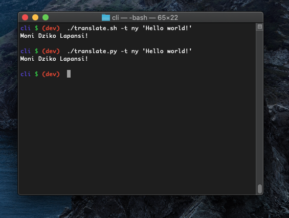

# translate

Originally a cli for a practice programming challenge on [Topcoder](https://www.topcoder.com), __translate__ is now a cross-platform translation app
that leverages the Google Translation API and allows me to practice using
all the frameworks I have used in the past.

  
Bash and Python scripts are working.

   
The latest working prototype in ios using React Native.

## License
All work is released under the MIT license. See [`LICENSE`](/LICENSE.md) for more details.
