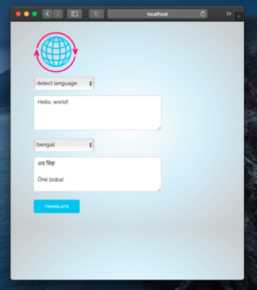
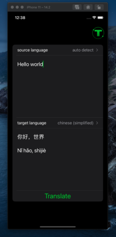
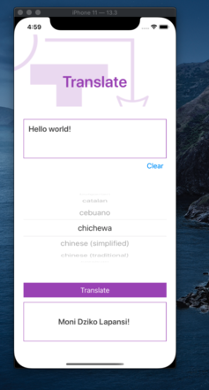

# translate

Originally a cli for a practice programming challenge on [Topcoder](https://www.topcoder.com), __translate__ is now a cross-platform translation app
that leverages the Google Translation API.

## platforms

### command line
  * [bash](/cli/translate.sh)
  * [python](/cli/translate.py)

### mobile
  * [react-native](/mobile/react-native)
    * android
    * ios
  * [SwiftUI](/mobile/SwiftUI)
    * ios

### web
  * [django](/web/django)

## samples

   
Web app with django.

   
ios app with SwiftUI

  
Bash and Python scripts are working.

   
working prototype in ios using React Native.

## License
All work is released under the MIT license. See [`LICENSE`](/LICENSE.md) for more details.
